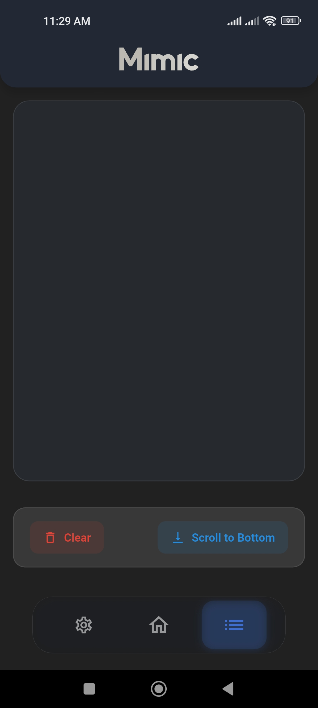
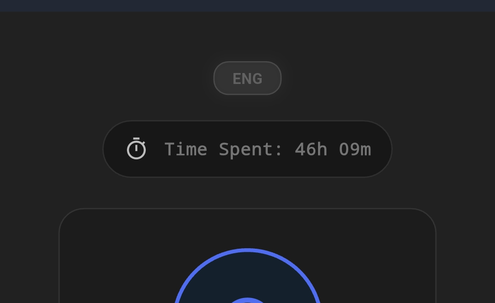

<h1 align="center">Mimic</h1>

Android App For Lazy People and Lkosala.

  
  
  
  
  
  
  

## 📱 About Mimic
Mimic is an Android application designed to mimic users using Altissia platform for reaching the required hours on the platform without any effort while you are sleeping or doing other things you like. Mimic is a perfect solution for lazy people like me.

## ✨ Features
- Runs in the background
- Tracks spent time on the app 🕐
- Easily switches between languages 🌐
- Supports multiple accounts 🫂
- Utilizes configurations (cookies) for login
- The configuration is encrypted and stored locally on the device 📦
- Manages errors to prevent them from triggering alerts in Sentry
- Consumes only 1.32% battery per hour 🔋
- Minimal memory usage 
- Low data usage (1-2 MB per 20 hours of background usage) 📉
- No tracking or collecting of personal data 🚫
- See the [VirusTotal Scan](https://www.virustotal.com/gui/file/8d7a29c74b9bf60764271e41abbbe261c09976b65d010f695ba7c21d0bcf10d8/detection) for more information ✅

By using this app, you agree to the [Terms and Conditions](https://mimicapp.web.app/terms.html) ❗

## 🚀 Upcoming Features

> - ✅ ~~Global Link Support~~ (Added in [v1.0.59](https://github.com/h4fide/mimic/releases/tag/v1.0.59 "v1.0.59")). Thanks to `@Quinouu` 🙏
> - ⏳ **Add Activities**

## 📸 Screenshots

  
  &nbsp;&nbsp;&nbsp;&nbsp;
  
  &nbsp;&nbsp;&nbsp;&nbsp;
  

  
  &nbsp;&nbsp;&nbsp;&nbsp;
  

## 📥 Installation
Download the latest version from the [Releases](https://github.com/h4fide/mimic/releases) page or visit [Mimic Website](https://mimicapp.web.app) 

1. Open the app
2. Go to the `Settings` then click on the `Configurations`
3. Get your Config from this browser extension [Extractease](https://extractease.netlify.app/)
4. Paste the configuration in the app
5. Click on the `Save` button
6. Click on the `Start` on the home screen
7. Sit back and relax while the app does the work for you 😎

## 📝 Notes
- The app will be available on the Play Store soon..
- Fetching spent time from the Altissia may not work sometimes at day time due to the platform's restrictions (i don't know why, but it works fine at night during my tests 🤷‍♂️)
- The app is not open-source, but the code is available for review upon request.

## 🎯 Yes, it works
> ### I have tested the app by letting it run while I sleep 😴  

| **FROM** | **TO** |
|------------|-----------|
|  |  |
<h4 align="left" style="font-style: italic; text-shadow: 2px 2px 4px rgba(100, 06, 250, 0.5);">I believe you can now complete your 100 hours in just 4 days 😎 </h4>

## ⚠️ Disclaimer
<h4 align="center" color="red">This app is for educational purposes only. The developer is not responsible for any misuse of this app.</h4>
